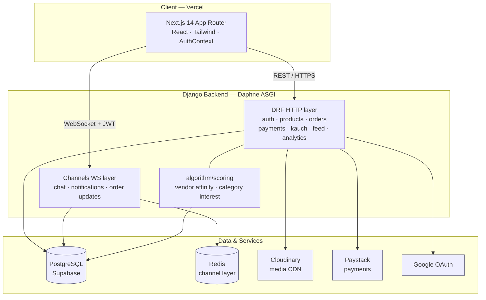
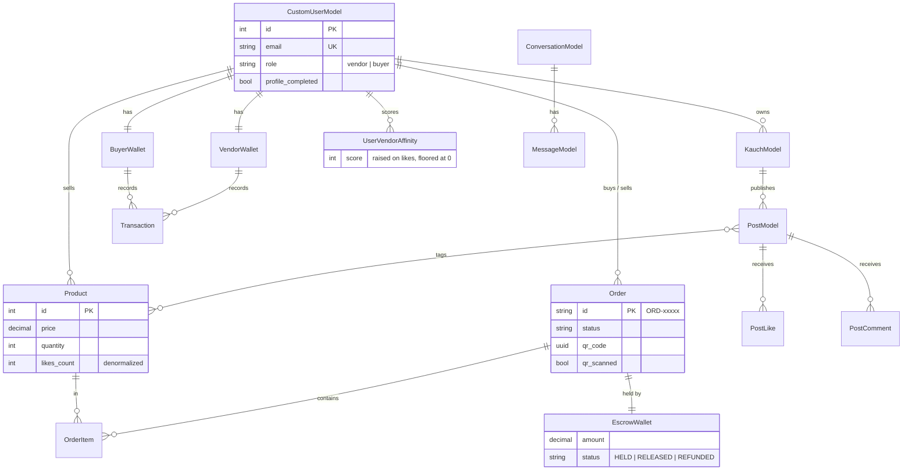
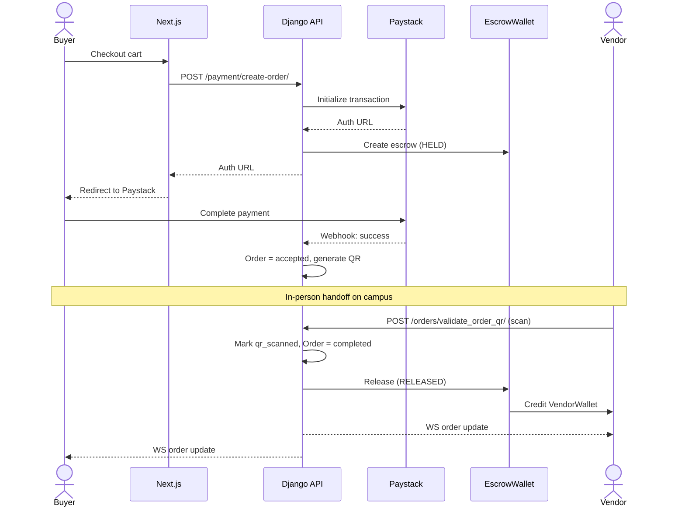
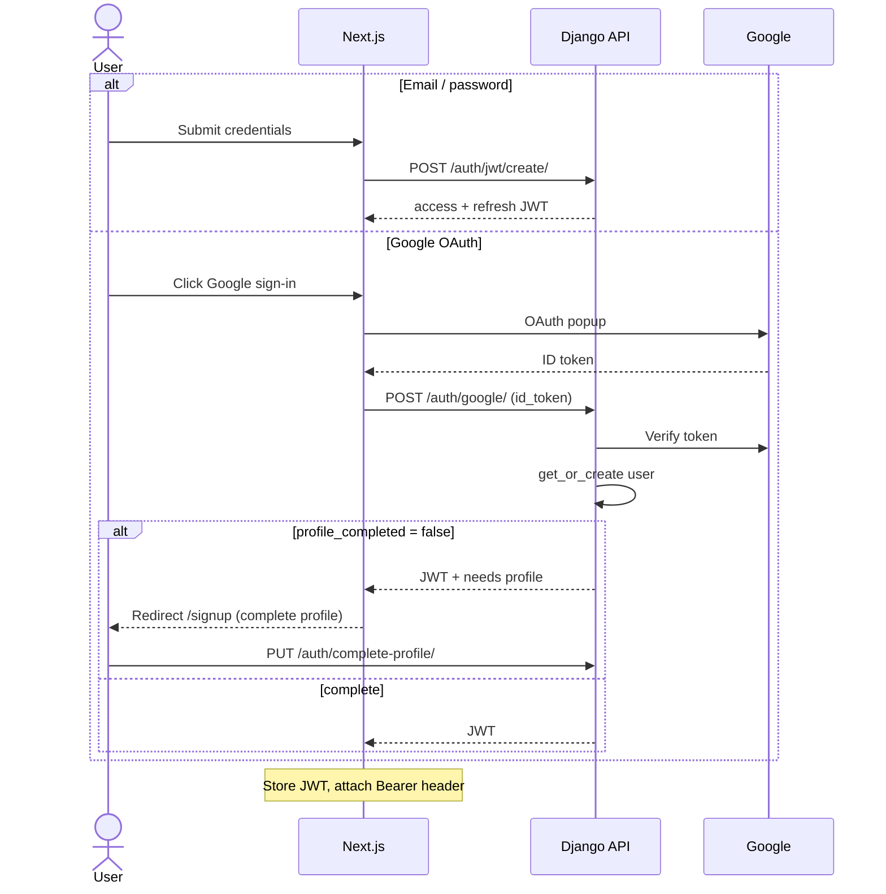
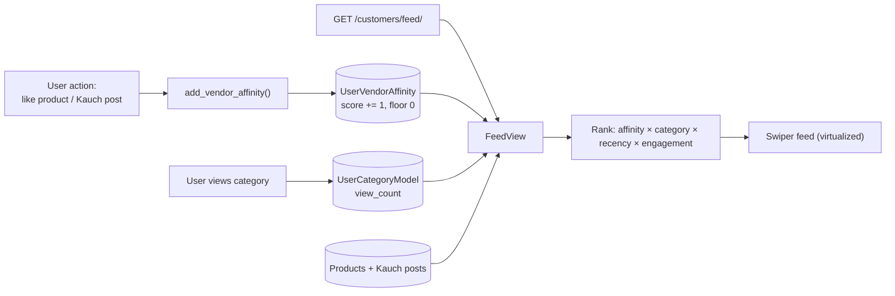

# Kauchy — System Design

Kauchy is a full-stack campus marketplace that combines **e-commerce** (listings, cart,
escrow payments, in-person QR fulfillment) with **social commerce** (vendor "Kauch"
channels, follows, likes, comments) and a **personalized feed** driven by behavioral
affinity scoring.

**Stack:** Django 5.2 + DRF + Channels · Next.js 14 / React 18 · PostgreSQL · Redis ·
Cloudinary · Paystack.

> The diagrams below are [Mermaid](https://mermaid.js.org/). They render automatically in
> GitHub, GitLab, and VS Code (with a Mermaid extension). To export to PNG/SVG:
> `npx -p @mermaid-js/mermaid-cli mmdc -i docs/system-design.md -o docs/diagrams/out.svg`

---

## 1. Architecture Overview

---

## 2. Data Model (core entities)

---

## 3. Escrow + Order Fulfillment Flow

---

## 4. Authentication Flow (JWT + Google OAuth)

---

## 5. Personalized Feed Ranking

---

## 6. Key Design Decisions & Tradeoffs

| Decision | Rationale | Tradeoff |
|---|---|---|
| Escrow-based payments | Trust between unknown campus peers | More order state; needs release logic |
| QR in-person fulfillment | Campus commerce is local/physical | No remote shipping flow |
| Like-based affinity (not views) | Higher-signal personalization | Cold-start for new users |
| Denormalized counters | Fast feed/card reads | Sync risk if model overrides missed |
| Channels + Redis | Real-time chat/notifications | Redis becomes a hard dependency |

---

## 7. Production Hardening Checklist

- [ ] `DEBUG = False`; restrict `ALLOWED_HOSTS` and CORS (currently permissive)
- [ ] Shorten JWT lifetimes (currently ~123 days); move tokens to secure cookies, not `localStorage`
- [ ] Add DRF rate-limiting / throttling
- [ ] Validate media uploads (type, size) at the boundary
- [ ] Ensure no secrets are committed; rotate any tracked `.env` values
- [ ] Enforce HTTPS + HSTS
